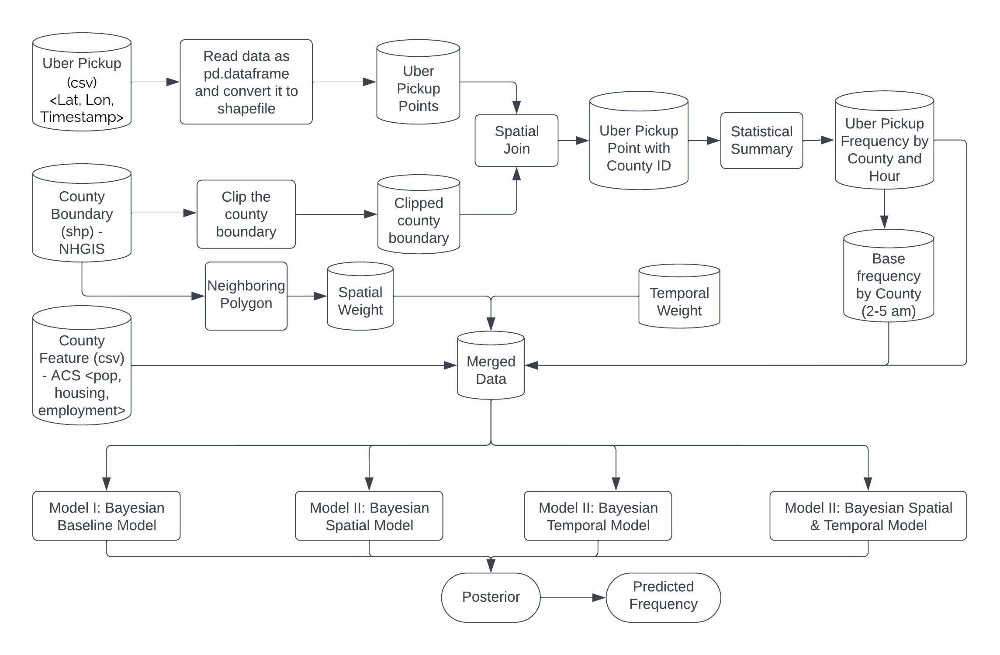

I recently completed a project analyzing Uber pickup data in New York City to understand spatial, temporal, and spatio-temporal patterns. I developed several hierarchical Bayesian models to predict the number of Uber pickups across New York City counties over time.

The models incorporated zone characteristics like population, employment, and housing units as predictors. I also added spatial and temporal dependency terms to account for neighboring county effects and rush hour peaks:

* <b>Base Model</b>: Included only zone characteristics
* <b>Spatial Model</b>: Added a spatial dependency term to capture effects from neighboring counties
* <b>Temporal Model</b>: Added a temporal dependency term to model rush hour peaks and daily patterns
* <b>Spatial-Temporal Model</b>: Incorporated both spatial and temporal dependency terms

The spatial terms followed a Conditional Autoregressive (CAR) prior to share information across neighbors. The temporal terms also used a CAR prior to smooth over time.

I pulled raw pickup data from Kaggle and spatial boundary and zone characteristic data from NHGIS. After data cleaning and processing, exploratory analysis revealed clear temporal peaks and spatial concentrations of pickups near the NYC core.

Evaluation metrics, such as Mean Absolute Deviance (MAD) and Akaike Information Criterion (AIC), showed that the spatial-temporal models performed the best by balancing model fit and complexity.

The codes and detailed documents can be retrieved via my [GitHub Repo](https://github.com/YaxuanSeanZhang/Bayesian-Uber-Pickup).
